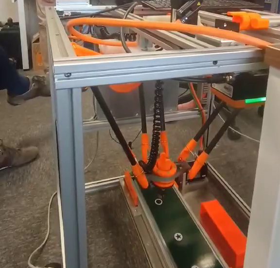

[](https://github.com/mboiar/gesture_controller/actions/workflows/cmake.yml)

# Gesture Controller

A modular, high‑performance gesture‑based controller written in C++.  
It translates hand gestures captured by a camera into control commands for robots or drones, with built‑in support for **OPC UA** communication and real‑time video processing.

## Examples

| Drone Software‑in‑the‑Loop Simulation | Delta Robot PLC (OPC UA) |
|:-------------------------------------:|:-------------------------:|
| [](https://youtu.be/OrVqN6P2TyY) | [](https://youtube.com/shorts/yFY8yK7BDtM) |

## Features

- **Remappable gesture commands** – easily change which gesture triggers which action.
- **Multi‑device support** – connect to any device that provides a video stream and accepts commands (serial, OPC UA, etc.).
- **Resource‑efficient** – runs well on constrained hardware (e.g., Raspberry Pi, PLC Companion Computer).
- **Face detection** – using OpenCV’s Haar cascade to focus the gesture recognition region.
- **Gesture detection** – ResNet18 model trained on a custom dataset, executed with ONNX Runtime.
- **OPC UA integration** – read robot status (position, mode, servo OK) and send jog commands to industrial controllers.
- **Simulation mode** – test the control logic without hardware.
- **Asynchronous logging** – spdlog provides colour‑coded, thread‑safe logs.

## Architecture

The project is split into several modules:

- **`Controller`** – gesture/face detection, and command dispatching.
- **`GenericDevice`** – abstract interface for any controllable device (simulated, serial, OPC UA).
- **`OPCUA_Device`** – concrete implementation that talks to an OPC UA server (e.g., a PLC controlling a delta robot).
- **Face & Gesture detectors** – wrappers around OpenCV and ONNX Runtime.

## Dependencies

- **C++17** compiler (gcc, clang)
- **CMake** 3.10+
- **OpenCV** (≥4.5)
- **spdlog** -logging
- **open62541** – OPC UA client
- **argparse** – command‑line argument parsing

## Building

```
git clone https://github.com/mboiar/gesture_controller.git
cd gesture_controller
mkdir build && cd build
cmake ..
make -j$(nproc)
```

